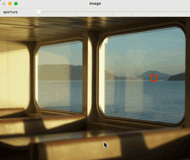

# synthesis-depth-of-field
Final project for CMU 15-663 Computational Photography

Chenhao Yang

---

Given a in-the-wild all-in-focus image, we can generate synthetic defocus blur for it to have a nice bokeh effect.

|  |  |
| ------------------ | ------------------ |
|  |  |

